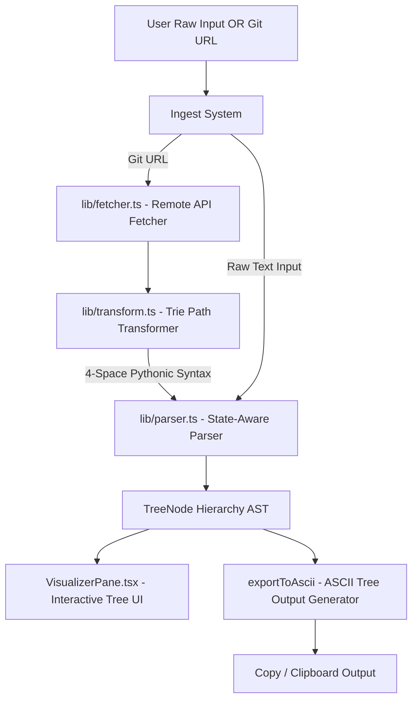

<!-- BEGIN:nextjs-agent-rules -->
# This is NOT the Next.js you know

This version has breaking changes — APIs, conventions, and file structure may all differ from your training data. Read the relevant guide in `node_modules/next/dist/docs/` before writing any code. Heed deprecation notices.
<!-- END:nextjs-agent-rules -->

# Brutalist Tree Visualizer & Remote Git Ingester — Developer Summary & Architectural Guide

Welcome, future Agent! This handbook serves as a comprehensive system map of this specialized **Tree Visualizer** codebase. It outlines our core parsing guidelines, recursive path fetchers, trie transformations, user interface components, and design aesthetics.

---

## 🏗️ System Overview & Architectural Blueprint

The application parses custom indentation-based Pythonic tree definitions into structured hierarchies, rendering them visually and generating premium ASCII directories. It is also equipped with a remote Git tree ingester.



---

## 🎨 Monochrome Brutalist Design System & Theme

The project implements a high-contrast **Monochrome Brutalist** style matching a classic Shadcn zinc theme.

### 🔑 Key Theme Features:
- **Global Typography**: Clean monospace theme variables. The fonts are globally mapped to monospace via CSS custom properties (`--font-sans: var(--font-mono); --font-mono: var(--font-mono); --font-heading: var(--font-mono);`).
- **Selection Highlight**: Reverses colors dynamically:
  ```css
  ::selection {
    background: var(--foreground);
    color: var(--background);
  }
  ```
- **Brutalist Webkit Scrollbars**: Custom styled scrollbars with sharp borders, square corners, and solid color indicators matching current light/dark themes:
  - Width & Height: `10px`
  - Track: solid border left & top
  - Thumb: `var(--muted)` with single pixel border
- **Shadcn Color Tokens**: Powered by modern CSS variables in HSL/OKLCH for seamless Light & Dark modes:
  - **Light mode**: Background `#ffffff` (`oklch(1 0 0)`), foreground `oklch(0.09 0 0)`.
  - **Dark mode**: Background `#09090b` (`oklch(0.09 0 0)`), foreground `oklch(0.98 0 0)`.
- **Brutalist Shadows**: High-contrast, sharp solid box shadows (e.g., `shadow-[6px_6px_0px_0px_rgba(0,0,0,1)]`).

---

## 🛠️ Core Engines & Logical Services

### 1. The Core Parser (`lib/parser.ts`)
Processes a custom pythonic-indentation structure. It translates text lines into a hierarchical Abstract Syntax Tree (`TreeNode[]`) using **5 distinct lexical rules**:

*   **Rule 1: Ignored Directives via State-Aware Lexing**
    Triple quotes (`"""`) define a multi-line docstring containing metadata. A state-aware scanner parses these blocks (supporting escape sequences and inline quote tracking) and strips them from the raw tree source, saving them to `directives` and `docstring` outputs.
*   **Rule 2: Hierarchy Assignment via Whitespace Indentation**
    Computes node depth based on leading spaces/tabs. Exactly **4 spaces** or **1 tab** constitutes one nesting level (`level`).
*   **Rule 3: Sibling Resolution with Parent Call Stacks**
    Maintains a list of active parent directories on a stack. When a node at indentation `L` is processed, directories are popped from the stack until its length matches `L`, placing the current node as a child of the top-of-stack directory.
*   **Rule 4: Node Typing**
    Nodes terminating with a colon (`:`) are recognized as `directory` nodes. All others are typed as `file` nodes.
*   **Rule 5: Literal Escaping**
    Wrapping file/folder names in single quotes (`'`), double quotes (`"`), or backticks (`` ` ``) preserves internal colons and semicolons as characters in the filename, stripping the surrounding quotes during parsing.

#### ASCII Tree Generation
The `exportToAscii` function exports the AST tree back to standard ASCII diagrams. Supported options:
- `fancy`: Controls unicode branch connectors (`├──`, `└──`, `│   `) versus basic characters (`|---`, `---`, `|   `).
- `fullPath`: Toggles absolute path expansion (e.g. `dir/subdir/file.txt`).
- `trailingSlash`: Appends `/` characters at the end of directory names.
- `useRoot`: Prepends a virtual root folder (`.`).

---

### 2. The Remote Repo Fetcher (`lib/fetcher.ts`)
Programmatically fetches complete, recursive files and directory schemas from public remote repositories.

- **Supported Providers**:
  - **GitHub**: Uses the recursive git tree API (`/repos/{owner}/{repo}/git/trees/{branch}?recursive=1`).
  - **GitLab**: Queries the GitLab repository tree API (`/projects/{id}/repository/tree?recursive=true&ref={branch}&per_page=100`). **Supports self-hosted and custom GitLab-hosted domains** (e.g., `gitlab.gnome.org`) via general RegExp parsing.
  - **Gitea / Codeberg**: Leverages the Gitea git trees recursive API.
- **Normalizations**: Normalizes repository URLs, handles trailing `.git` extensions, detects missing branches or invalid repository paths, and outputs standard `RepoFileEntry` arrays `{ path, type }`.

---

### 3. The Path-to-Tree Transformer (`lib/transform.ts`)
Converts flat repository structures returned by `fetchRepoTree` into the custom 4-space indented Pythonic tree layout.

- **Mechanism**: Builds an in-memory **Trie data structure** by splitting flat paths with `/`.
- **Sorting Logic**: Sorts directory keys first, followed by file keys, sorting each subset alphabetically.
- **Conversion Output**: Performs a depth-first traversal of the Trie, rendering parent directory nodes with a trailing `:` and indenting children recursively by 4 spaces.

---

## 🧩 User Interface Components (`components/ui/`)

### 1. `EditorPane.tsx` (Monaco Editor Integration)
A high-fidelity code writing pane built on `@monaco-editor/react`.
- **Monaco Lexer Customization**: Defines a custom token provider (`tree-syntax`) that highlights triple-quoted directives, escaped strings, and colon-terminated directories.
- **Zinc Light & Dark Themes**: Custom Monaco themes tailored to match our Shadcn variables (`zinc-dark` & `zinc-light`), highlighting keywords in rose (`#f43f5e`), strings in green (`#22c55e`), and comments in zinc (`#71717a`).
- **Toolbar Features**: Includes a cheatsheet sidebar drawer, a dropdown to select default boilerplate templates, dynamic line/character counting, editor font resizing, and quick controls for reset/clear/copy.

### 2. `VisualizerPane.tsx`
Renders the parsed tree output and serves as the visual viewer/config panel.
- **Visual Options Grid**: Settings modal allows toggle-based configurations for virtual roots, trailing slashes, path prepending, and fancy unicode connectors (saved to `localStorage`).
- **Export Control**: Aggregates metadata directives and ASCII diagrams for copy-to-clipboard actions.
- **Filtering System**: Case-insensitive text filter highlights matching paths using custom marking regex tags.
- **Fidelity Statistics**: Displays node quantities, folders, maximum depth, and parsing speeds in milliseconds.

### 3. `FetchPane.tsx`
An expandable header panel housing the Git Repository Fetching engine.
- Contains brutalist form inputs for repository URLs and branch targets (with fallback error alerts).
- Connects fetched paths straight into the transformer and feeds it directly into the state of the parent app page.

### 4. `SplitPane.tsx`
A smooth, resizable container that allows dragging boundaries to resize the Editor (left) and Visualizer (right) layouts.

---

## 💡 Developer Guidelines for Future Enhancements

- **Strict Type Checking**: Keep AST parsing and transformer types aligned. Any new syntax rule must be updated in `lib/parser.ts` as well as Monaco's custom monarch tokenizer inside `EditorPane.tsx`.
- **Theme Integrity**: Maintain the minimal brutalist styling. Avoid introducing raw bright primary colors; rely on OKLCH CSS variables, monospace layouts, and clean 1px border details.
- **Caching & Rate Limits**: When extending the `fetcher.ts` service, respect rate-limiting headers from external Git providers.
